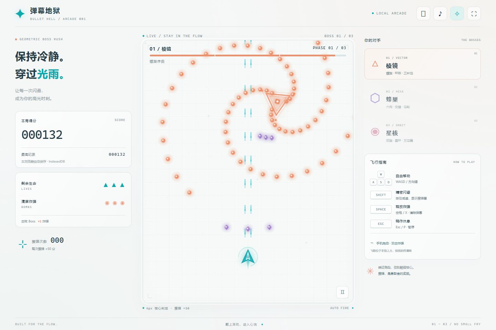
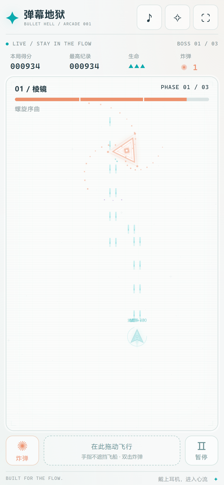

# 弹幕地狱 · Bullet Hell

浅色霓虹风格的浏览器 Boss Rush 游戏。三场决战，九重弹幕，一次极限。

**[立即游玩](https://yjj0339.github.io/danmaku-hell/)** · 手机和电脑均可访问，无须安装。



## 玩法

- 青色飞船自由移动，自动向上开火，没有普通敌人。
- 三角「棱镜」、六边形「蜂巢」、圆形「星核」，连续三场 Boss 战。
- 每位 Boss 三个阶段，血量严格低于 66% 和 33% 时切换攻击模式，包含螺旋、环形、花形弹幕。
- 4px 中心判定；每颗子弹只计一次擦弹，每次 +50 分。
- 初始三条命、三颗炸弹；炸弹清除弹幕，击败 Boss 补充一颗。
- 最高分保存在当前浏览器的 IndexedDB 中。不同设备和访问地址的纪录独立。
- CRT 扫描线、发光子弹、射击与命中音效、爆炸反馈，以及开始、暂停、失败和通关画面。

## 操作

| 设备 | 移动 | 炸弹 | 其他 |
| --- | --- | --- | --- |
| 电脑 | WASD / 方向键，也可按住鼠标拖动 | 空格 / X | Shift 精密闪避；Esc / P 暂停；M 音效 |
| 手机 | 拖动画面，或拖动底部触控区 | 双击画面/触控区，或点击炸弹按钮 | 点击暂停按钮 |

手机竖屏利用完整可用高度；底部触控区按下时飞船不跳位，手指不遮挡战场。手机按钮至少 44px，并留出刘海和底部安全区。电脑自动适配窗口，可使用右上角「▯」切换专注竖屏。旋转屏幕、全屏或调整窗口会保留当前进度。



## 本地运行

项目没有外部运行依赖。下载后直接双击 `弹幕地狱.html` 即可离线游玩。

安装 Node.js 后也可从项目目录运行：

```sh
node server.cjs
```

打开 http://localhost:4177。运行 `node build.cjs` 可以重新生成离线单文件。

## 发布

GitHub Pages 从 `main` 分支根目录发布。资源均使用相对路径，支持项目站点路径。更新网页源码后提交到 `main` 即会重新部署；修改源码后应同时重新生成离线 HTML。

## 验证

发布前完成 18 种屏幕尺寸、150 项适配检查和 44 项玩法检查，包括手机竖屏/横屏、触控、窗口与地址栏高度变化、最高分保存和三场 Boss 流程。
